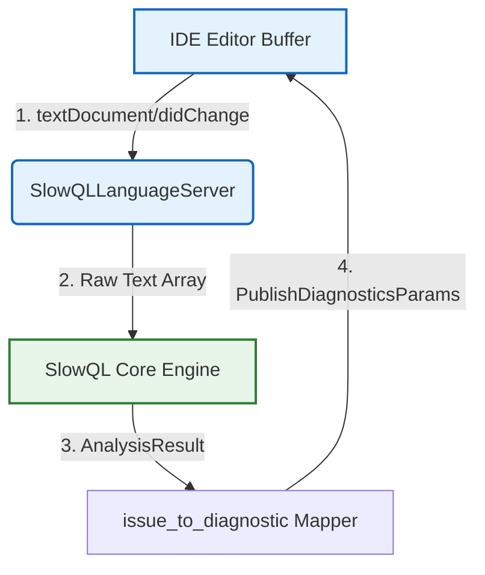

# Language Server Protocol (LSP) Integration

In addition to traditional CI/CD file scanning and terminal execution, SlowQL ships an embedded **Language Server** utilizing the open `pygls` extension framework. This allows SlowQL to natively communicate with *any* code editor (VS Code, Neovim, IntelliJ) supporting the LSP standard, projecting analysis results directly onto the user's cursor instantly.

## The `server.py` Architecture

Located in `src/slowql/lsp/server.py`, the core object `SlowQLLanguageServer` handles the asynchronous bi-directional stream between the developer's Integrated Development Environment (IDE) and the SlowQL engine.



## Instant Event Triggers

The LSP intercepts live text manipulation directly inside the editor memory without waiting for disk writes. The `server.py` implementation hooks onto three core LSP features:
- `TEXT_DOCUMENT_DID_OPEN`
- `TEXT_DOCUMENT_DID_CHANGE`
- `TEXT_DOCUMENT_DID_SAVE`

Whenever the developer presses a key in their SQL file, `pygls` fires the `_validate_document()` wrapper. This synchronously executes `engine.analyze()` entirely in RAM against the modified document boundary.

## Severity Mappings

To securely translate SlowQL results into native IDE squiggly lines accurately, `server.py` explicitly maps the `Severity` enums into `DiagnosticSeverity` constants mandated by the protocol:

- **SlowQL CRITICAL & HIGH** $\rightarrow$ `DiagnosticSeverity.Error` (Red Underlines).
- **SlowQL MEDIUM** $\rightarrow$ `DiagnosticSeverity.Warning` (Yellow Underlines).
- **SlowQL LOW** $\rightarrow$ `DiagnosticSeverity.Information` (Blue Underlines).

## Invocation

The server runs via Stdio connection and is technically an optional component to keep the binary lightweight. Users must deploy `pip install slowql[lsp]` to obtain `pygls` before natively running the explicit standalone binary wrapper:

```bash
slowql-lsp
```
