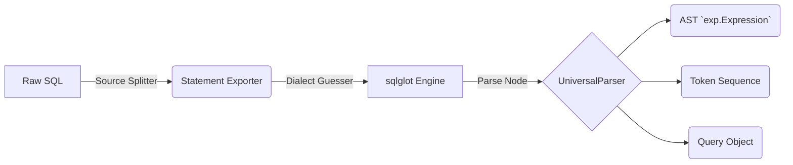

# Parser Engine

SlowQL relies on an extensible SQL parser architecture, operating at both the AST component-level and raw semantic token levels. The backbone of SlowQL's parsing infrastructure is built upon the blazing-fast and versatile `sqlglot` library.

## The Universal Parser

Unlike legacy static analyzers that attempt to define arbitrary regex patterns over multiline queries, SlowQL features the `UniversalParser`.

The `UniversalParser` acts as a highly resilient translation layer:
1. **Source Splitting**: Before anything is translated to an AST, raw SQL strings containing multiple semi-colon delimited scripts are reliably chunked by the `SourceSplitter`. If the chunker crashes on a malformed query, it safely falls back to standard regex semicolon extraction, guaranteeing high robustness.
2. **Dialect Normalization**: If the user omits `--dialect` configuration, the parser leverages a heuristic `DIALECT_DETECTION_RULES` object to assign the execution space. For instance, detecting backticks (`` ` ``) assigns `mysql`, while identifying `ROWNUM` assigns `oracle`.
3. **AST Extraction**: `sqlglot.parse_one()` natively translates the string into a node tree based on its schema bindings (`exp.Select`, `exp.Table`, `exp.Column`).
4. **AST Binding**: SlowQL wraps the `exp.Expression` alongside extracted metadata tables into a unified `Query` dataclass that is handed to the Rules logic.

## The Raw Tokenizer

If rules are built via `PatternRule` (and therefore completely skip the `sqlglot` AST binding), they often still require normalized structural arrays to run safely. 

SlowQL's native `Tokenizer` engine (`src/slowql/parser/tokenizer.py`) runs at nearly **O(1) sequential speeds**, slicing fragments of SQL by generating tokens mapped to static `TokenType` enums:
- ` TokenType.KEYWORD` (Identifies strings appearing in a rigid 250+ predefined ANSI list).
- `TokenType.IDENTIFIER` / `TokenType.QUOTED_IDENTIFIER` (For dynamic table strings).
- `TokenType.LPAREN`, `TokenType.STRING`, and `TokenType.COMMENT`.

Because the tokenizer understands string boundaries via contextual escape character detection (handles dollar quoting `$$`, multi-line strings, and `/*` comment structures correctly), regex rules can accurately assess the raw text without accidentally flagging strings nested inside comments or literals.
