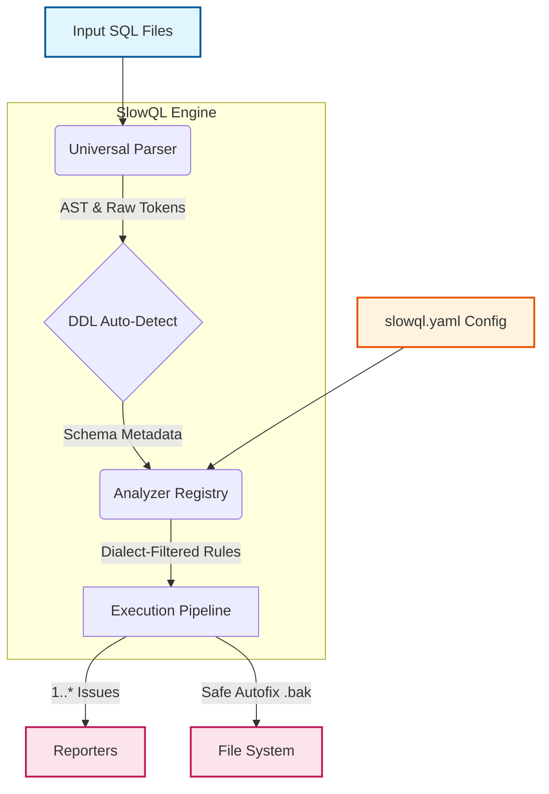

# System Architecture Overview

SlowQL is designed as a high-performance, stateless static analysis engine. At its core, it processes raw SQL text into Abstract Syntax Trees (ASTs) using explicit grammar dialects, then routes those trees through categorical analyzers containing hundreds of discrete rules.

## High-Level Pipeline

The complete lifecycle of a `slowql` analysis run, coordinated by the main [`SlowQL` engine class](../api/python-api.md), follows this strict pipeline:

## 1. SQL Ingestion & Parsing
SQL files are ingested and instantly split into individual statements via the `SourceSplitter`. The `UniversalParser` then leverages the immensely powerful `sqlglot` library to transform these raw text chunks into fully mapped Abstract Syntax Trees (ASTs).

If no dialect is provided in `slowql.yaml`, `UniversalParser` utilizes a Regex-based scoring system (`DIALECT_DETECTION_RULES`) to auto-detect the dialect (Postgres, BigQuery, Snowflake, etc.) before parsing.

## 2. DDL Auto-Detection
Before executing rules, the `engine.py` quietly scans the raw queries for `CREATE TABLE` statements. If found, it routes them to the `SchemaInspector` which parses `DDL` logic to establish a mock-schema in memory. This enables schema-aware rules (like `MissingIndexRule` or `ColumnExistsRule`) to operate correctly without connecting to a live database.

## 3. The Analyzer Registry
SlowQL groups its huge library of rules into specific dimensional **Analyzers** (`SecurityAnalyzer`, `PerformanceAnalyzer`, etc.) which all inherit from `BaseAnalyzer` or `CompositeAnalyzer`.

The `AnalyzerRegistry` natively discovers and loads these components from entry points on boot, making the architecture highly extensible.

## 4. The Execution Pipeline
Inside `RuleBasedAnalyzer`, every single active rule (`ASTRule` or `PatternRule`) is executed against the parsed ASTs. 
Because `slowql` enforces strict Dialect Guardians (e.g., `dialects=("snowflake",)` on rules), the pipeline automatically and safely skips rules that aren't relevant to the current dialect, practically eliminating false positives. 

## 5. Result Aggregation
Finally, any triggered rule yields an `Issue` object containing the `RemediationMode`, `Severity`, explicit location, and potentially a `FixConfidence.SAFE` replacement string.

The Engine accumulates these into an `AnalysisResult` dataclass and passes them to the configured **Reporter** (e.g., Cyberpunk TUI Console, `SARIF` for CI/CD Pipeline, or JSON hook).